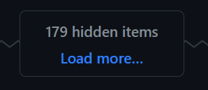

# Better GitHub.com

This extensions is a mishmash of improvements to my GitHub experience.

The extension icon will show 2 options:

1. Expand all Hidden Items
    Very active GitHub issues and PRs have their content hidden behind a "Load more" UI  
      
    This option will click these "load more" buttons until there are no more to click.
2. Hide All Commits From Issue
    On issue pages each commit that mentions the issue gets a history entry, this command will hide them all to reduce the noise and be able to focus on the conversation.

## Development process

I develop this extension on Firefox following this steps:

1. Open [about:debugging#/runtime/this-firefox](about:debugging#/runtime/this-firefox)
2. Click on "Load Temporary Add-on..."
3. Open the manifest.json file
4. Click Reload every time I do any changes

## Generating the extension

Install dependencies with:

```
yarn
```

Run the following command to build the extension's zip file:

```
yarn run build
```